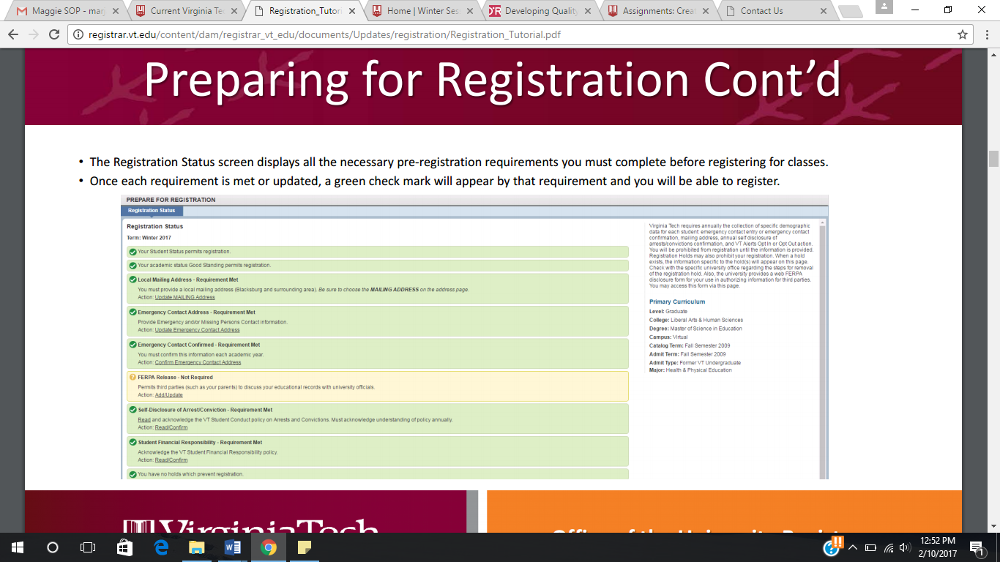

# Current VT Student Registration for Winter or Summer Courses

If you are currently an enrolled student, you can learn how to choose
summer and winter classes with the steps below.

To be considered a "currently enrolled student", you must have already
completed the previous term at Virginia Tech or have been enrolled in
the previous semester.

## Requirements

- VT PID and password

- Computer connected to Internet

- Completion of any outstanding pre-registration requirements which
    can be viewed under the "registration and schedule" menu of HokieSpa
    (see figure 1).

**NOTE**: Green checkmarks indicate completed registration requirements.
ALL fields must be green to proceed to the registration steps.

{width="5.753472222222222in"
height="3.2291666666666665in"}

## Steps

1. Check 2017 summer and winter session schedules to ensure you are
    applying for the right coursers at the right time

    --------------------------------------------------------------------------------------------------------

    Summer Session 1    <http://registrar.vt.edu/dates-deadlines-accordion/index1/First-Summer-2017.html>

    --------------------------------------------------------------------------------------------------------

    Summer Session 2    <http://registrar.vt.edu/dates-deadlines-accordion/index1/Second-Summer-2017.html>

    --------------------------------------------------------------------------------------------------------

    Winter Session      <http://registrar.vt.edu/dates-deadlines-accordion/index1/Winter-2017.html>

    --------------------------------------------------------------------------------------------------------

2. Log in to HokieSpa using your VT PID and password
3. Click "Registration and Schedule" from the main menu of HokieSpa
4. Click "Register for Classes"
5. Select the term you would like to register for (winter or summer)
    and click "Continue"
6. Read the financial notice pop-up and click "Ok" to continue
7. Search for classes by entering the subject, course number, or key
    words into the search bar. Select "Advanced Search" to include any
    further details about the course(s) you are looking for.
8. Click "Search" after filling all desired fields
9. Click "Add" once you have selected which course you want to enroll
    in. The selected course will appear under "Schedule" and "Summary"

    a.  Repeat step 8 to add more than one class to your schedule.

    > **NOTE**: Be mindful of the minimum and maximum total hours in which
    > you can register. This information is visible at the bottom of your
    > registration summary.
10. Click the "Submit" button to complete the addition to your
    registration. The course status will change from "Pending" to
    "Registered"
